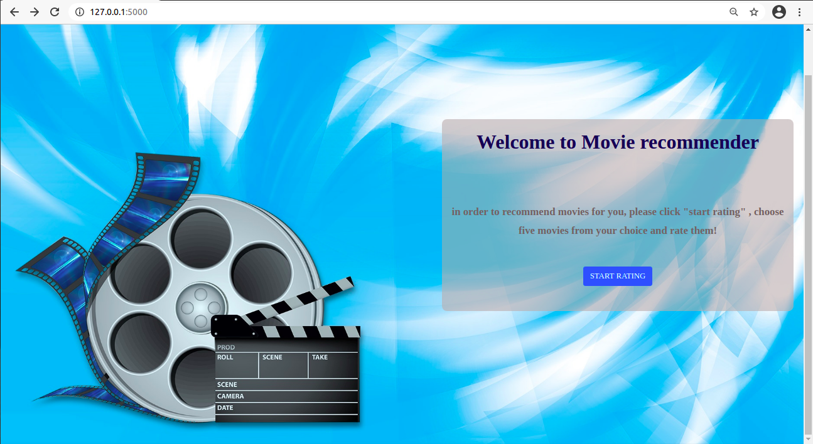
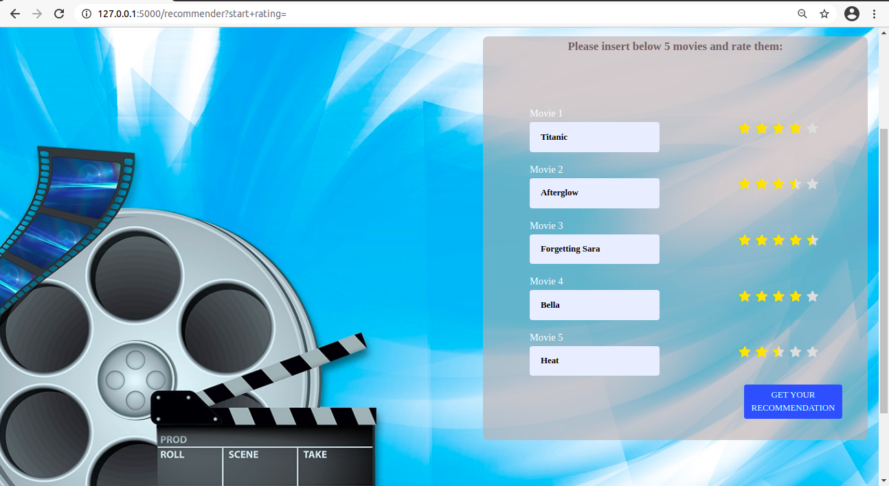
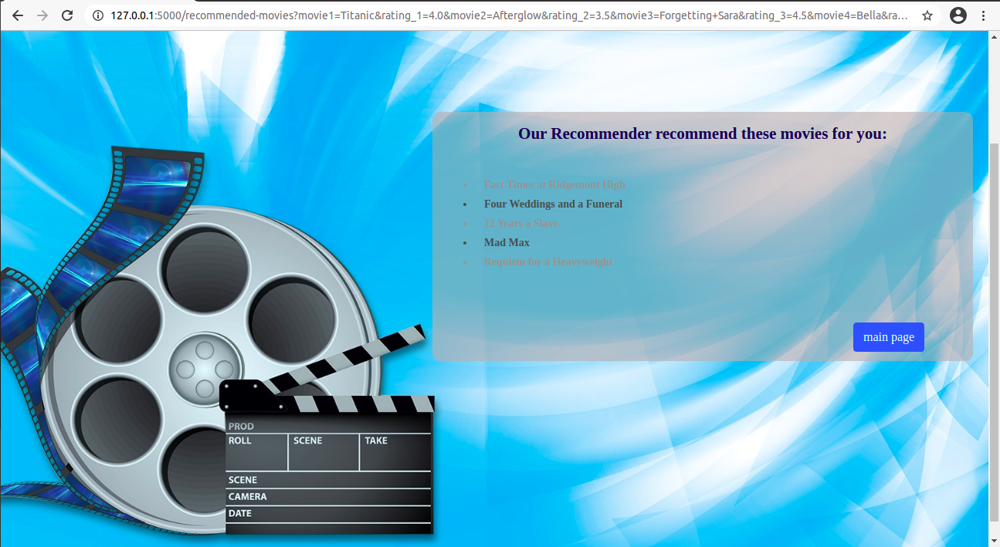

# Movie-Recommender

A web-based movie recommender engine, recommends movies to the user in one of two algorithms:
  - Non-negative matrix factorization
  - Collaborative Filtering: User-based Filtering recommendation

### Usage:
- clone the repository
- login to your postgres and create a database called: movies_db

  so you should have the following connection:  connection = postgresql://localhost:5432/movies_db
 - run data_preprocessing.py , so the data is read from csv files, processed and stored in movies_db
 - you can choose in application.py between the two algorithms:
    - recommended_movies = recommend_NMF()
    - recommended_movies = user_based_filtering_recommend()
 - run application.py and go to your browser and type: localhost/5000

the use has to input five movies and rate them:

and then the user gets his recommended movies:

## Tech used:
 - Python
 - Flask
 - HTML
 - CSS
 - PostgreSQL
 - sqlalchemy
 - Scikit-learn

## License

- **[MIT license](http://opensource.org/licenses/mit-license.php)**

